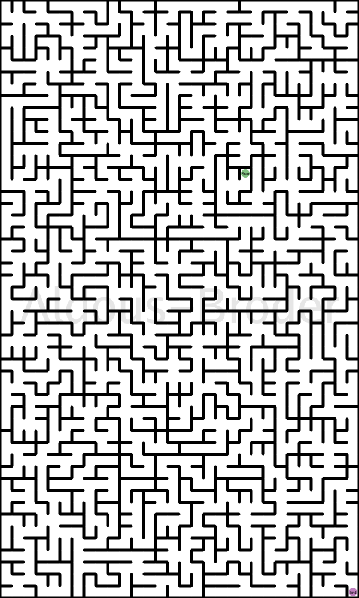

# Maze Generator

This code is based on the excellent book "Mazes for Programmers" by Jamis Buck.

I've translated some of those algorithms to Go and to C, just for amusement.

In particular, the Aldous-Broder algorithm produces a fun maze:

